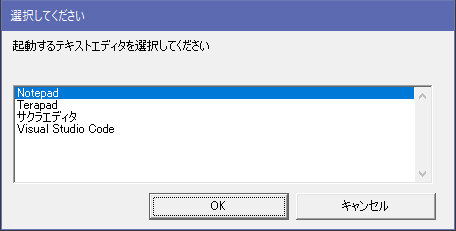
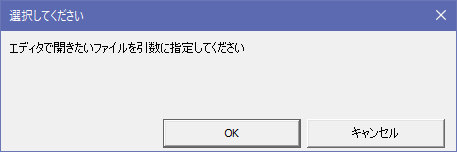

## DlgDropdownList （スクリプトから呼び出すダイアログボックス単体表示）<!-- omit in toc -->


[Home](https://oasis3855.github.io/webpage/) > [Software](https://oasis3855.github.io/webpage/software/index.html) > [Software Download](https://oasis3855.github.io/webpage/software/software-download.html) > [win-scripts](../README.md) > ***DlgDropdownList_VisualC*** (this page)

<br />
<br />

Last Updated : Jun. 2021

- [ソフトウエアのダウンロード](#ソフトウエアのダウンロード)
- [概要](#概要)
- [コマンドラインでの使い方（リストボックス表示）](#コマンドラインでの使い方リストボックス表示)
- [コマンドラインでの使い方（YES/NO選択表示）](#コマンドラインでの使い方yesno選択表示)
- [動作確認](#動作確認)
- [バージョンアップ履歴](#バージョンアップ履歴)
- [ライセンス](#ライセンス)

<br />
<br />

## ソフトウエアのダウンロード

-     [このGitHubリポジトリを参照する（ソースコード）](../DlgDropdownList_VisualC/)

## 概要

VBScriptやバッチファイルでは、リストボックスでユーザ選択が可能なダイアログボックスは実装されていないため、それを可能とするツールである。ユーザが選択した結果（リストのNo）は、プログラムのExit Codeとして得られる。


## コマンドラインでの使い方（リストボックス表示）



プログラムの引数が2個以上の場合は、リストボックス表示が行われ、ユーザが選択したリストボックス項目の番号（1～）がExit Codeとして返される。キャンセルの場合は0が返される。

なお、引数の文字列は ``` " ・・・・ " ``` ダブルクォーテーションで囲むことで、空白文字（スペース）を含んだものを扱うことができる。

```
DlgDropdownList.exe "メッセージ 文字列" 選択肢1 "選択肢 その2" ...
```

## コマンドラインでの使い方（YES/NO選択表示）



プログラムの引数が1個以上の場合は、YES/NO選択ボタンがあるメッセージボックス表示が行われ、ユーザが選択したExit Codeが返される。YESの場合は1、NOの場合が2である。

```
DlgDropdownList.exe "メッセージ 文字列"
```

## 動作確認

- Windows 10
- Windows 11

- ソースコードは Visual C++ 2019 でビルド可能

## バージョンアップ履歴

- Version 1.0 (2021/06/14)

## ライセンス

このプログラムは [GNU General Public License v3ライセンスで公開する](https://gpl.mhatta.org/gpl.ja.html) フリーソフトウエア
